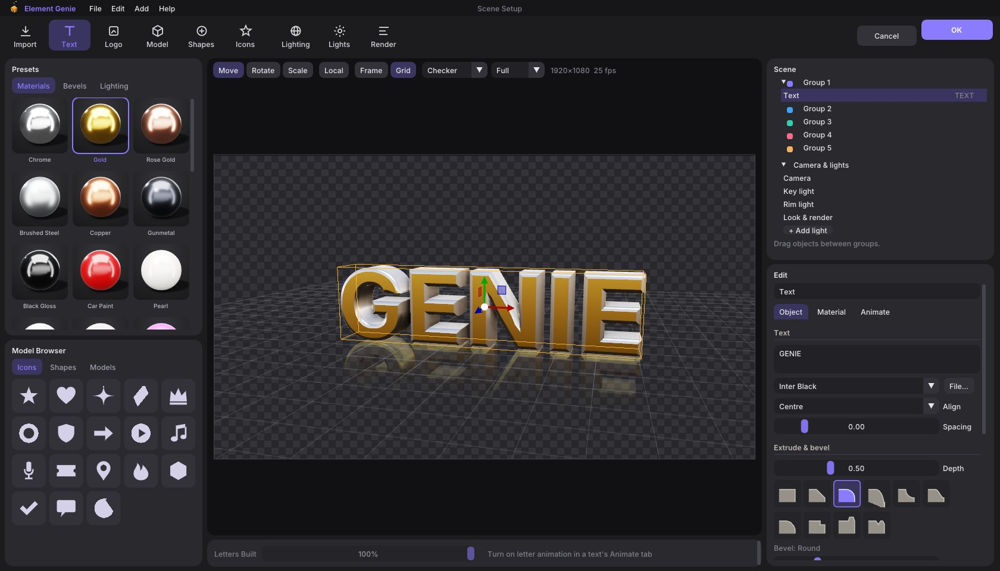
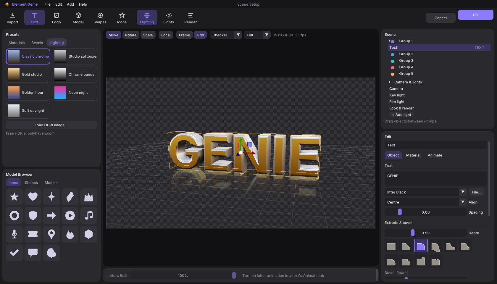
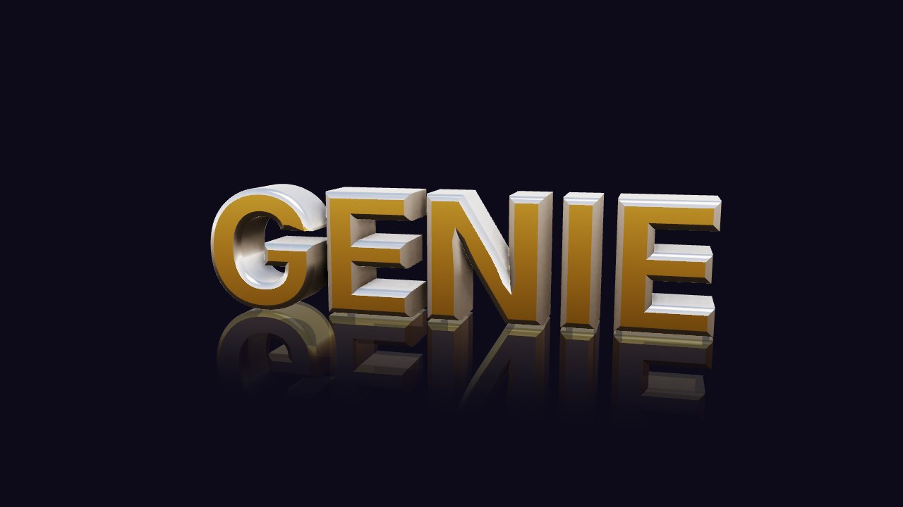

# Element Genie

**Free, open-source 3D titles for Premiere Pro and After Effects.**
Made by [Genie Studio FX](https://geniestudiofx.github.io/genie-studio/).

Build 3D text, logos and models without leaving your edit. Drop the effect on an adjustment layer, click **Scene Setup…**, design your title, press **OK**, then keyframe it in Effect Controls.

| Lighting presets | Final render |
|---|---|
|  |  |

## Features

- 3D text with 10 bevel styles, and extruded SVG / PNG logos
- 28 materials (gold, chrome, car paint, glass…) and 7 lighting presets, or load your own HDRI
- Import OBJ, FBX, glTF / GLB models, plus 18 built-in icons and 9 shapes
- Soft shadows, ambient occlusion, floor reflections, glow, anti-aliasing and motion blur
- 5 groups you can animate in Effect Controls, plus camera orbit, zoom and letter-by-letter build
- **Per Letter** controls: rotate, move and scale every letter on its own, with ramp, wave and random spreads
- **Twist** deform along X, Y or Z, keyframeable

## Download

Get the installer from the **[website](https://geniestudiofx.github.io/genie-studio/element-genie.html)**.
Windows 10 / 11 · Premiere Pro or After Effects. Restart Premiere after installing and find it under **Effects › Element Genie**.

> Windows may show a "Windows protected your PC" box because the installer isn't code-signed yet. Click **More info → Run anyway**.

## Build it yourself

Element Genie is cross-compiled for Windows with MinGW (tested on Linux).

1. Install `mingw-w64` (posix threads), `cmake` and `git`.
2. Download the **Adobe After Effects SDK** (free, from Adobe's developer site) and set `AE_SDK` to its `Examples` folder.
3. Fetch the libraries: `./get-deps.sh`
4. Build the PiPL resource from `plugin/ElementGeniePiPL.r` with the SDK's `PiPLtool`, then compile it with `windres` to `plugin/pipl.o`.
5. Build: `./build.sh` → `build/ElementGenie.aex`, `build/Element Genie Scene Setup.exe` and `build/Element Genie Installer.exe`.

`test/host.cpp` is a small fake host for testing renders without Premiere.

## Licence

MIT — see [LICENSE](LICENSE). Free to use, change and share. Third-party licences are listed in [THIRD_PARTY_NOTICES.md](THIRD_PARTY_NOTICES.md).

Element Genie is an independent project and is not affiliated with Adobe or Video Copilot.
